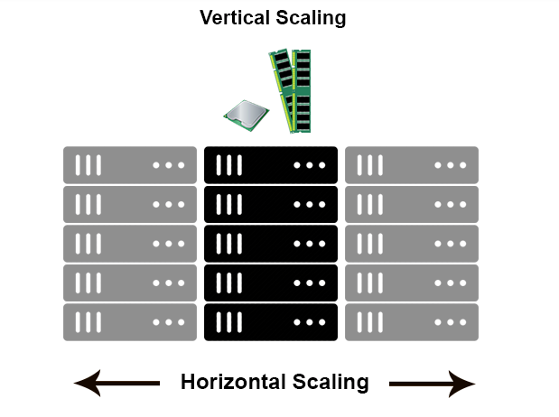
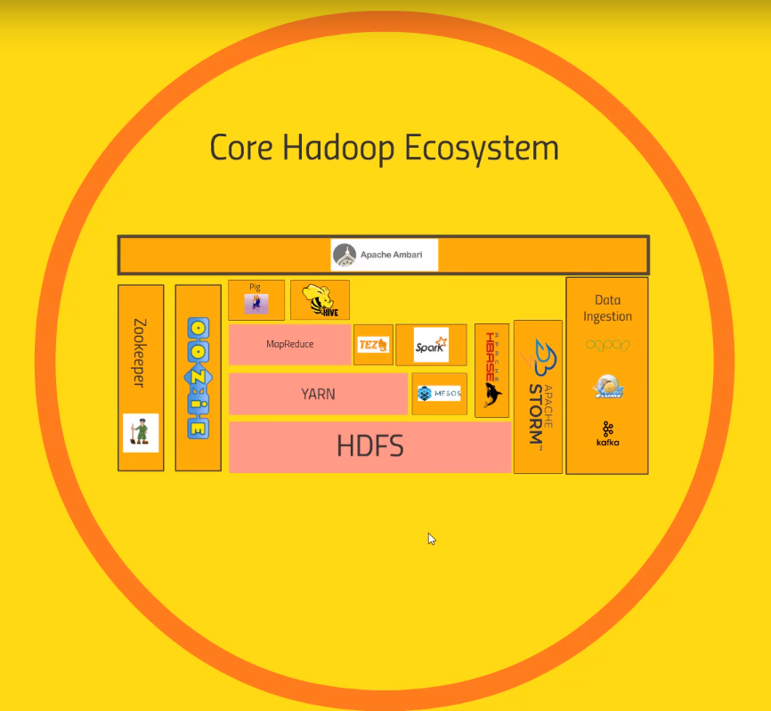
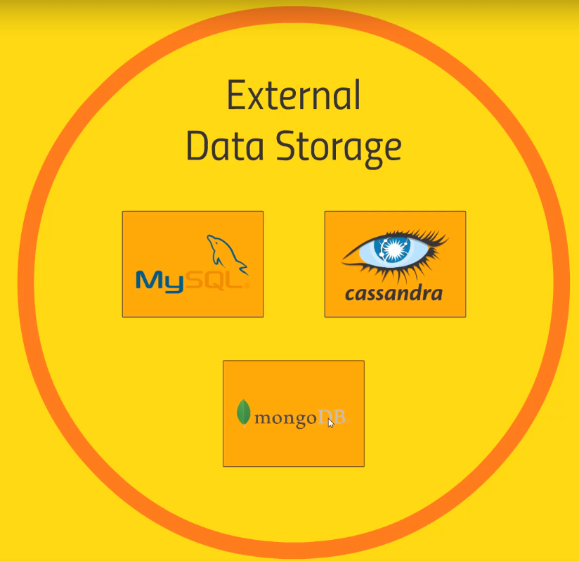
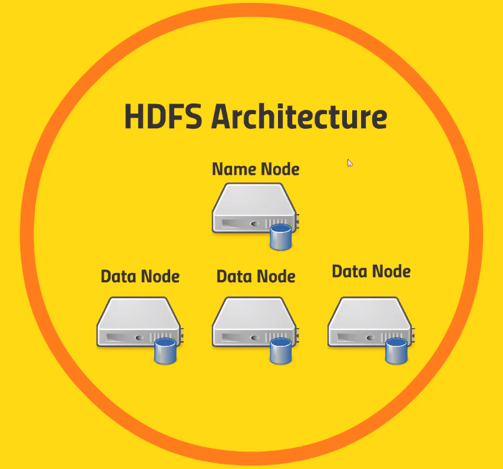
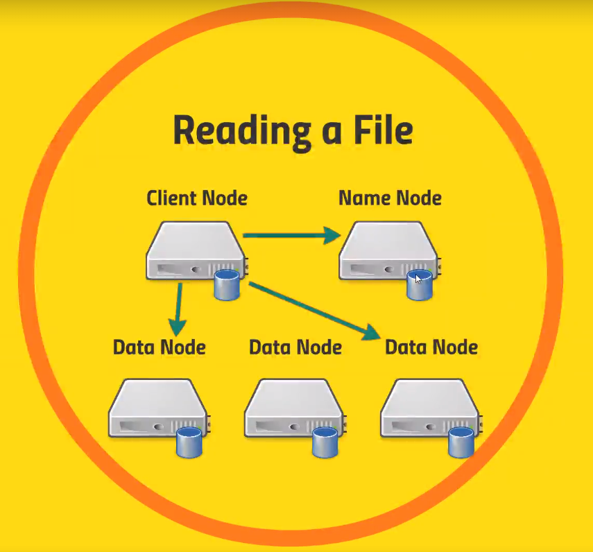
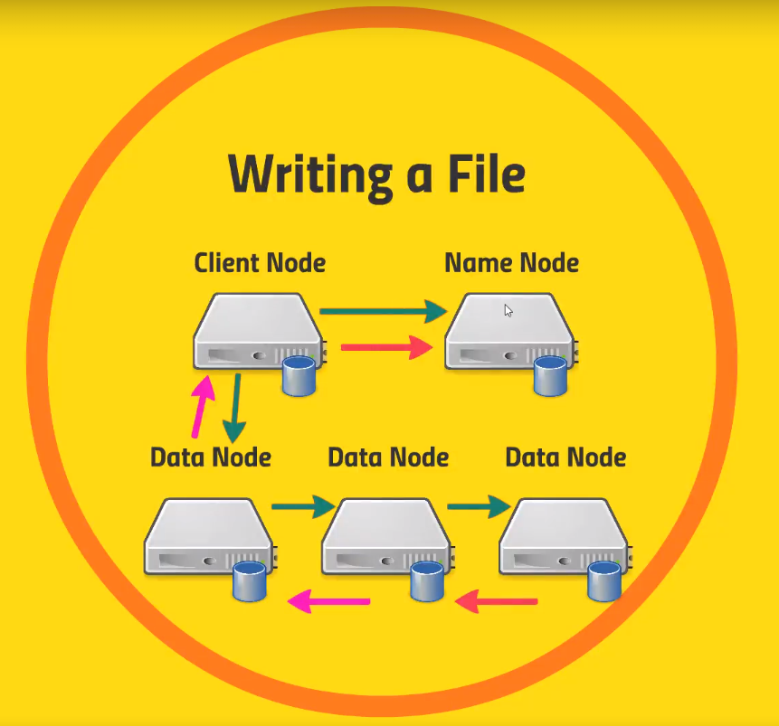
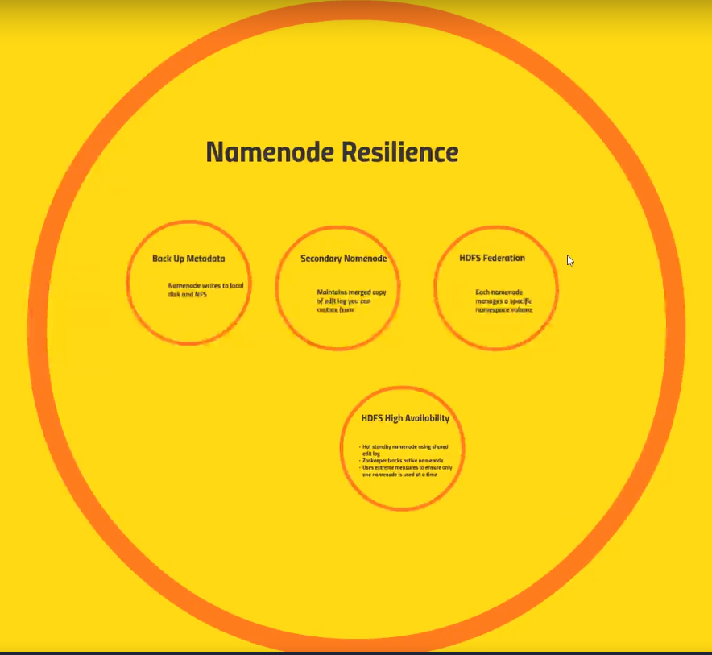

# The Ultimate Hands-On Hadoop - Tame your Big Data!

* Install Horton works stack (that contains Hadoop and other tools)
    * `cd HDP_3.0.1_docker-deploy-scripts_18120587fc7fb/`
    * `sh docker-deploy-hdp30.sh`
        * In case you experience a port issue like: 
            * `C:\Program Files\Docker\Docker\Resources\bin\docker.exe: Error response from daemon: driver failed programming external connectivity on endpoint sandbox-proxy (2e13894570ec36a982eb51009448c128854214a8286088e01da9f7881b6dd100): Error starting userland proxy: Bind for 0.0.0.0:50070: unexpected error Permission denied.`
            * You can fix it by setting different ports inside the `sandbox/proxy/proxy-deploy.sh` file, this is dynamically generated when we run `sh docker-deploy-hdp30.sh`  
                * Edit file `sandbox/proxy/proxy-deploy.sh`
                * Modify conflicting port (first in keypair). For example, `6001:6001` to `16001:6001`
                * Save/Exit the File
                * Run bash script: bash `sandbox/proxy/proxy-deploy.sh`
                * Repeat steps for continued port conflicts
    * Verify sandbox was deployed successfully by issuing the command: `docker ps`
        * You should see two containers, one for the `nginx` proxy and another one for the actual tools
            * 
    * In order to stop the HDP sandbox just run:
        * `docker stop sandbox-hdp`
        * `docker stop sandbox-proxy`
        * To remove the containers you just need to do:
            * `docker rm sandbox-hdp`
            * `docker rm sandbox-proxy`
        * To remove the image just run:
            * `docker rmi hortonworks/sandbox-hdp:3.0.1`
            * `docker rmi hortonworks/sandbox-proxy:1.0`
    * To start just run:
        * `docker start sandbox-hdp`
        * `docker start sandbox-proxy`
    * In case you want a CNAME, you can add this line to your hosts file:
        * `127.0.0.1 sandbox-hdp.hortonworks.com `
            * `C:\Windows\System32\drivers\etc\hosts` on Windows
            * `/etc/hosts` on a MacOSX
    * Now we are able to open `Ambari` by accessing:
        * `http://sandbox-hdp.hortonworks.com:1080/splash.html`
        * `sandbox-hdp.hortonworks.com:8080` or `127.0.0.1:8080`
    * The default `Ambari` user is:
        * username: `maria_dev`, password: `maria_dev`

* First, we will import both `ml-100k` `u.data` and `u.item` using `Hive`
    * You can find `Hive` by clicking the menu icon on the top right corner
    * After importing the data, we are able to run SQL queries even though the data is saved in a Hadoop cluster (HDFS) 
        * `SELECT movie_id, count(movie_id) as ratingCount FROM ratings GROUP BY movie_id ORDER BY ratingCount DESC`
        * `SELECT name FROM movie_names WHERE movie_id = 50;`

## Hadoop Overview and History

* "An open source software platform for distributed storage and distributed processing of very large data sets on computer clusters built from commodity hardware" - Hortonworks

* Google published papers about GFS (Google File System) and MapReduce - 2003-2004

* Yahoo! was building "Nutch", and open source web search engine at the same time
    * Doug Cutting and Tom White started putting Hadoop together in 2006
    * Hadoop was the name of one of the toys of Doug Cutting child. Yellow stuffed elephant 

* Data is too darm big - terabytes per day
* Vertical scaling doesn't cut it 
    * In a database world horizontal-scaling is often based on the partitioning of the data i.e. each node contains only part of the data, in vertical-scaling the data resides on a single node and scaling is done through multi-core i.e. spreading the load between the CPU and RAM resources of that machine.
        * With horizontal-scaling it is often easier to scale dynamically by adding more machines into the existing pool - Vertical-scaling is often limited to the capacity of a single machine, scaling beyond that capacity often involves downtime and comes with an upper limit.
    * Vertical scaling means more memory and cpu in the existent machines
    * Horizontal scaling means more machines
    * Vertical scaling issues:
        * Disk seek times
        * Hardware failures 
        * Processing times
    *  
* It is not just for batch processing anymore

## Hadoop Ecosystem

* World of Hadoop
    * Core Hadoop Ecosystem
        * 
        * HDFS: Hadoop Distributed File System
            * Makes all the hard drives looks like a single one
            * Also, it is responsible for data redundancy (recover)
        * YARN: Yet Another Resource Negotiator
            * Sits on top of HDFS
            * Manages the resources in your computer cluster
                * What gets to run when
                * Which nodes are available
        * Mesos
            * An alternative to YARN
            * Also a resource negotiator 
            * Solve the same problem in different ways
        * MapReduce
            * Sits on top of YARN
            * Process you data across an entire cluster
            * It consists of Mappers and Reducers
                * Mappers: transform your data in parallel 
                * Reducer: aggregate data together 
        * Spark
            * Sitting at the same level of MapReduce
            * Works with YARN or Mesos
            * To run queries on your data
                * Also handles SQL queries, ML tasks, streaming data
            * Write your spark scripts using Java, Scala or Python
                * Scala being preferred 
        * Tez
            * Similar to Spark (direct acyclic graph)
            * Tez is used in conjunction with Hive to accelerate it
        * HBase
            * Exposing the data on your cluster to transaction platforms 
            * NoSQL database (large transaction rates)
            * Fast way of exposing those resources to other systems
        * Apache Storm
            * Process streaming data in real time (log data is an example)
                * Sensor data
            * Spark streaming solves the same problem, but in a different way
            * Update your ML models, or transform data in a database in real time (no batch processing)
        * Pig
            * Sits on top of MapReduce
            * A high level programming API that
            * Allows us to write simple scripts that looks a lot like SQL in some cases
                * Chain queries together without coding Java or Python
            * This script will be transformed in something that runs on top of MapReduce 
        * Hive
            * Sits on top of MapReduce
            * Makes this HDFS files system looks like a SQL database
            * You can connect to it using a shell client or even a driver like ODBC 
        * Oozie
            * A way of scheduling jobs in your cluster
            * More complicated operations 
        * Zookeeper
            * Coordinating everything in your cluster
            * Which nodes are up, which nodes are down
            * Keeping track of who the master node is
        * Apache Ambari (used by Hortonworks)
            * Sits on top of everything
            * Lets us have an overview of everything in your cluster
                * How much resources
                * What is up and running?
            * View of the cluster
        * **Data Ingestion**
            * How you get data into your cluster
            * Scoop
                * A tool that enables anything that communicates using ODBC, JDBC (realtional database) to Hadoop
                * A connector between Hadoop and your legacy databases
            * Flume
                * A way of transporting web logs
                * Group of web services, get those logs and get those inside the cluster
            * Kafka
                * Collect data from any source and broadcast that to your hadoop cluster
    * External data storage (integrating with Hadoop cluster)
        * 
        * HBase also fits here
        * MySQL
            * Import / exports data with Scoop / Spark
        * Cassandra (key/value data store)
        * MongoDB (key/value data store)
    * Query Engines
        * 
        * Hive also fits here
        * Apache Drill 
            * Write SQL queries that works in a wide range of NoSQL dbs (HBase, Cassandra, MongoDB)
        * Hue
            * Creating queries with Hive and HBase
        * Apache Phoenix
            * Similar to Drills
            * Guarantees ACID
        * presto
        * Apache Zeppling
           
## HDFS and MapReduce

* Handling large files (broken up across a large cluster)
    * Breaking into blocks (128 megabytes blocks)
    * Stored across several commodity computers 
        * They may be even located nearby each other in the network to minimize reads/writes 
    * The same block will be saved in more than one computer, that way generating redundancy
        * If a node goes down, it is ok
    * 
        * Name node: This guy tracks where all those blocks live. It maintains a big table with the virtual file name, and it knows its associated blocks (which nodes it is stored in)
            * It also maintains an edit log (what is being created, what is being modified, what is being stored) to keep track where the blocks are
        * Data node: Store each block of each file
    * 
        * We have a `Client Node` running our application
        * First thing it will do is to talk to the `Name Node` asking for a specific file
            * The `Name Node` will come back with a list of blocks and `Data Nodes` where they are located.
            * It will also optimize this list with the best `Data Nodes` based on your location in the network
        * Finally, the client application will reach the `Data Nodes` in order to retrieve the blocks
    * 
        * Whenever you create a file your `Client Node` will first reach out to the `Name Node` in order to update his table. 
        * After that, the `Client Node` will reach to one of the `Data Nodes` in order to write the blocks. On that note, the `Data Node` will talk to other `Data Nodes` and distribute the blocks among them
            * The `Data Nodes` talk to each other in order to store the file
        * As soon as the file is saved, the `Data Node` sends a message back to the `Client Node`, and right after that the `Client Node` communicates the change to the `Name Node`.
    *  
        * Back Up Metadata: `Name node` writes to local disk and NFS
            * NFS: Network File System
        * Secondary Name Node: Maintains merged copy of edit log you can restore from 
        * HDFS Federation: Each `Name Node` manages a specific namespace volume
            * HFS is optimized for large files, and not so much for lots and lots of small files. However, in case you have lots and lots of small files, maybe a `Name Node` will reach its limit.
                * So HDFS Federation lets you assign a `Name Node` for a specific name space volume. 
            * This is not a backup technic, but at least in this situation you would not lose all of your data.
        * HDFS High Availability: 
            * Hot standby `Name Node` using shared edit log
                * No downtime. Your `Name Node` is actually writing to a share log in some reliable file system that is not HDFS. That way if your `Name Node` goes down, your hot `Name Node` will get in charge.
            * Zookeeper tracks active `Name Node`
            * Uses extreme measures to ensure only one `Name Node` is used at a time
    * Using HDFS
        * UI (Ambari)
        * Command-Line Interface
        * HTTP / HDFS Proxies
            * An example is Ambari/File View
        * Java interface
        * NFS Gateway

* To SSH into our Hadoop cluster we will connect to:
    * `maria_dev@127.0.0.1` at port `2222`
        * This port was mapped by our Hortonworks proxy container
    * The password for this account is `maria_dev`
    * We can run `hadoop fs -ls` to list the files under `maria_dev` user.
    * To create a directory we will do `hadoop fs -mkdir ml-100k`
    * Lets get some data: `wget http://media.sundog-soft.com/hadoop/ml-100k/u.data`
        * `hadoop fs -copyFromLocal u.data ml-100k/u.data`
        * `hadoop fs -rm ml-100k/u.data`
        * `hadoop fs -rmdir ml-100k`

* Why MapReduce?
    * Distributes the processing of data on your cluster
    * Divides your data up into partitions that are MAPPED (transformed) and REDUCED (aggregated) by mapper and reducer functions you define
    * Resilient to failure - an application master monitors your mappers and reducer on each partition